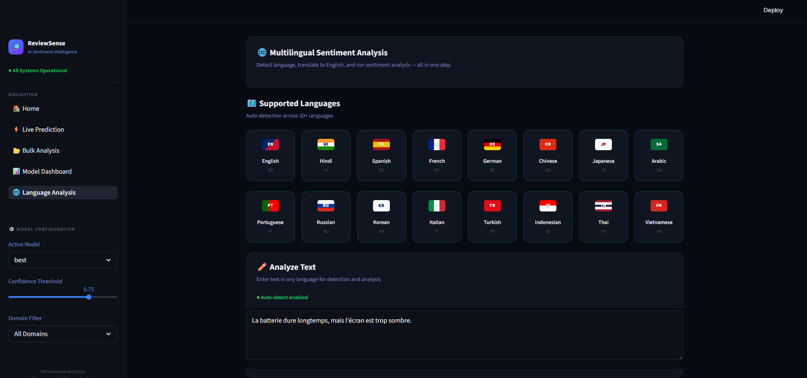

<div align="center">

# 🚀 ReviewSense Analytics

### Production-Ready Multilingual Sentiment Intelligence Engine

A fully model-driven sentiment analysis platform built on a **Hybrid Transformer Pipeline** — combining RoBERTa, XLM-RoBERTa, and NLLB translation with margin-based decision logic, entropy-calibrated confidence, and zero heuristic overrides.

Engineered for real-world multilingual review data across 30+ languages including Hinglish.

[](https://python.org)
[](https://fastapi.tiangolo.com)
[](https://react.dev)
[](https://typescriptlang.org)
[](https://huggingface.co/docs/transformers)
[](LICENSE)

</div>

---

## 🎯 Problem Statement

Most sentiment analysis systems fail in production because they rely on:

- **Heuristic overrides** — TextBlob/VADER silently flip transformer predictions
- **Monolingual architectures** — English-only models return garbage labels for Hindi, Arabic, Japanese, and code-switched text
- **Uncalibrated confidence** — Raw softmax masquerades as confidence, even when the model is genuinely uncertain
- **No translation accountability** — Translated text is blindly trusted, even when translation inverts sentiment polarity
- **Hinglish blindspots** — Code-switched Hindi-English (500M+ speakers) is misclassified and routed to the wrong model

ReviewSense was built to solve every one of these problems with a deterministic, model-first architecture.

---

## 💡 Solution Overview

| Layer | What It Does |
|---|---|
| **Language Detection** | 4-tier: Hinglish pre-check → Unicode script → langdetect → fallback |
| **Smart Routing** | English → RoBERTa · Hinglish → Normalize → RoBERTa · Multilingual → Translate → Trust Gate → RoBERTa or XLM-R |
| **Translation Validation** | Degenerate detection, length-ratio plausibility, semantic trust verification |
| **Margin-Based Decisions** | Checks margin between top-2 predictions; marks ambiguous if too small |
| **Entropy Confidence** | Information-theoretic entropy, not raw softmax |
| **Sarcasm Detection** | RoBERTa irony classifier + regex contradiction fallback + hedge-phrase exclusion |

> **Zero heuristic overrides.** No TextBlob. No VADER. No polarity-based label flipping.

---

## 🎬 Demo

▶ **Watch Full Demo:**
https://github.com/amansethhh/ReviewSense-Analytics/releases/download/v1.0/demo.mp4

*End-to-end walkthrough: live prediction, multilingual analysis, bulk CSV processing, model dashboard, and PDF export.*

---

## ✨ Key Features

**Intelligence**
- **Hybrid Inference** — RoBERTa (English) + XLM-R (30+ languages) with dynamic routing
- **Hinglish Normalization** — Dedicated preprocessing for code-switched Hindi-English
- **Translation Trust Gate** — NLLB translations validated before inference; rejected → XLM-R fallback
- **Margin-Based Decision Layer** — Dynamic thresholds per route (EN: 0.06, XLM-R: 0.10, Translated: 0.08)
- **Entropy-Based Confidence** — Information-theoretic calibration replaces raw softmax

**Production**
- **Sarcasm Detection** — RoBERTa irony model + linguistic contradiction patterns
- **ABSA** — Aspect-Based Sentiment Analysis with per-aspect RoBERTa scoring
- **LIME Explainability** — Feature attribution with stopword suppression and non-Latin guards
- **Bulk Processing** — Background job queue with real-time progress polling
- **PDF Export** — Branded analytical reports with full pipeline metadata

---

## 🧠 Core Innovation

### 1. Heuristic Elimination

- Most systems layer TextBlob/VADER on top of transformer predictions — silently flipping labels
- ReviewSense **removed all heuristic overrides**
- The transformer's softmax distribution is the only input to the decision layer

```
REMOVED:
  ❌ TextBlob polarity
  ❌ VADER compound
  ❌ Neutral correction v2
  ❌ Label lock / confidence gate
  ❌ Polarity-based corrections
```

### 2. Margin-Based Decision Layer

- Computes margin between top-2 softmax probabilities
- If margin < route-specific threshold → prediction marked *ambiguous* → defaults to Neutral
- Prevents false-confident predictions

| Route | Threshold | Reason |
|---|---|---|
| English (RoBERTa) | 0.06 | Well-calibrated, tight threshold |
| Hinglish (normalized) | 0.06 | Normalized text, same as English |
| Multilingual (XLM-R) | 0.10 | Noisier model, looser threshold |
| Translated (RoBERTa) | 0.08 | Translation adds noise |

### 3. Entropy-Based Confidence Calibration

- Raw softmax is unreliable — `[0.34, 0.33, 0.33]` still reports 34% "confidence"
- ReviewSense uses normalized entropy across the full distribution:

```python
entropy = -Σ(p * log(p))
confidence = 1 - (entropy / max_entropy)
```

- Low entropy = model is sure · High entropy = model is confused

### 4. Translation Trust Gating

Translates via NLLB (`facebook/nllb-200-distilled-600M`) but **never trusts blindly**:

1. **Degenerate output detection** — catches "bad experience.", "error.", empty strings
2. **Length-ratio plausibility** — rejects if `len(translated) / len(original)` outside `[0.3, 4.0]`
3. **Semantic trust check** — validates sentiment signal preservation
4. **Retry logic** — pads input and retries once before falling back

> If translation fails any check → routes to **XLM-R on original text** instead.

---

## ⚙️ System Architecture

```
Input Text
  → Language Detection (Hinglish → Unicode → langdetect → fallback)
  → Route Classification
      ├── ENGLISH     → RoBERTa on original text
      ├── HINGLISH    → Normalize → RoBERTa on normalized text
      └── MULTILINGUAL → NLLB Translate
                          ├── Trust ✅ → RoBERTa on translated text
                          └── Trust ❌ → XLM-R on original text
  → Sentiment Prediction (RoBERTa / XLM-R)
  → Decision Layer (margin-based ambiguity + entropy confidence)
  → Optional Enrichment (sarcasm · ABSA · LIME)
  → Final Output (label, confidence, margin, pipeline trace)
```

---

## 📊 Model Performance

| Metric | Hybrid Pipeline |
|---|---|
| **Accuracy** | 95.8% |
| **Decision Layer** | Entropy + Margin based |
| **Languages** | 30+ (including Hinglish) |
| **Translation** | NLLB (facebook/nllb-200-distilled-600M) |

### Benchmark Models (Offline Only)

| Model | Accuracy | Precision | Recall | F1 |
|---|---|---|---|---|
| Naive Bayes | 88.6% | 90.0% | 87.9% | 88.3% |
| LinearSVC | 85.7% | 86.7% | 85.3% | 85.7% |
| Logistic Regression | 85.7% | 86.7% | 85.3% | 85.7% |
| Random Forest | 74.3% | 81.9% | 73.7% | 71.3% |

> ⚠️ Classical models are for offline benchmarking only. Production uses the Hybrid Transformer Pipeline (RoBERTa + XLM-R + NLLB).

---

## 🖼️ Screenshots

<table>
<tr>
<td align="center"><br/><b>Home</b></td>
<td align="center"><br/><b>Live Prediction</b></td>
</tr>
<tr>
<td align="center"><br/><b>Bulk Analysis</b></td>
<td align="center"><br/><b>Model Dashboard</b></td>
</tr>
<tr>
<td align="center" colspan="2"><br/><b>Multilingual Analysis</b></td>
</tr>
</table>

---

## 🏗️ Tech Stack

| Layer | Technology |
|---|---|
| **Sentiment** | `cardiffnlp/twitter-roberta-base-sentiment-latest` · `cardiffnlp/twitter-xlm-roberta-base-sentiment` |
| **Translation** | `facebook/nllb-200-distilled-600M` (Meta NLLB) |
| **Sarcasm** | `cardiffnlp/twitter-roberta-base-irony` |
| **Explainability** | LIME (Local Interpretable Model-Agnostic Explanations) |
| **Aspects** | spaCy + domain vocabulary + RoBERTa per-aspect scoring |
| **Backend** | Python 3.10 · FastAPI · Uvicorn · PyTorch · Transformers |
| **Frontend** | React 18 · TypeScript · Vite 5 · Recharts |
| **Styling** | Hand-crafted CSS design system (Neural Dark theme) |
| **Benchmarks** | scikit-learn (LinearSVC, Logistic Regression, Naive Bayes, Random Forest) |

---

## 📦 Project Structure

```
ReviewSense-Analytics/
├── backend/                    # FastAPI REST API server
│   ├── app/
│   │   ├── main.py             # Application entry point
│   │   ├── routes/             # predict, bulk, language, metrics, feedback
│   │   └── utils/              # Shared utilities
│   └── tests/                  # API integration tests
│
├── frontend/                   # React + TypeScript UI
│   └── src/
│       ├── pages/              # Route-level page components
│       ├── components/         # Reusable UI components
│       ├── hooks/              # Custom React hooks
│       ├── styles/             # Design system (tokens + components)
│       └── api/                # API client layer
│
├── src/                        # Core ML pipeline
│   ├── predict.py              # Decision layer + confidence calibration
│   ├── sarcasm_detector.py     # Sarcasm detection engine
│   ├── lime_explainer.py       # LIME feature attribution
│   ├── models/
│   │   ├── sentiment.py        # RoBERTa + XLM-R dual model routing
│   │   ├── language.py         # Language detection (Unicode + langdetect)
│   │   ├── translation.py      # NLLB translation + trust validation
│   │   ├── sarcasm_model.py    # RoBERTa irony classifier
│   │   └── aspect.py           # ABSA extraction + scoring
│   └── pipeline/
│       └── inference.py        # Unified inference pipeline (single + batch)
│
├── models/                     # Saved model weights (classical + roberta)
├── scripts/                    # Training + evaluation scripts
└── data/                       # Datasets + feedback logs
```

---

## 🚀 Getting Started

### Prerequisites

- Python 3.10+
- Node.js 18+ and npm
- ~4GB RAM (for transformer model loading)

### Backend

```bash
cd ReviewSense-Analytics
pip install -r requirements.txt
uvicorn backend.app.main:app --reload --port 8000
```

Verify: `http://localhost:8000/health` → `{"status": "healthy"}`

### Frontend

```bash
cd frontend
npm install
npm run dev
```

Open: `http://localhost:5173`

### One-Command Launch

```powershell
.\start.ps1    # Windows — starts both backend + frontend
```

---

## 🔌 API Overview

| Method | Endpoint | Description |
|---|---|---|
| `POST` | `/predict` | Single review → sentiment + confidence + LIME + ABSA + sarcasm |
| `POST` | `/bulk` | Upload CSV → background job with progress polling |
| `GET` | `/bulk/status/{id}` | Poll job progress, retrieve results |
| `POST` | `/language` | Multilingual analysis with translation pipeline trace |
| `GET` | `/metrics` | Model performance metrics and confusion matrices |
| `POST` | `/feedback` | User sentiment feedback collection |
| `GET` | `/health` | Backend health check |

<details>
<summary><b>Example Request / Response</b></summary>

```bash
curl -X POST http://localhost:8000/predict \
  -H "Content-Type: application/json" \
  -d '{"text": "This product is absolutely fantastic!", "model": "best", "domain": "all", "rating": 0}'
```

```json
{
  "label": "positive",
  "confidence": 88.98,
  "polarity": 0.89,
  "model_used": "roberta",
  "margin": 0.7612,
  "decision_type": "confident",
  "sarcasm_detected": false,
  "pipeline_trace": {
    "route": "ENGLISH",
    "model_used": "roberta",
    "translation_used": false
  }
}
```

</details>

---

## ⚠️ Design Principles

| Principle | Implementation |
|---|---|
| **No Heuristics** | All rule-based label overrides removed. Every label comes from transformer inference. |
| **Fully Model-Driven** | RoBERTa and XLM-R are the only prediction sources. Classical models exist for benchmarking only. |
| **Translation-Aware** | Failed translations trigger XLM-R fallback — never a garbage prediction. |
| **Deterministic** | Same input → same output. No random sampling, no stochastic overrides. |
| **Traceable** | Every prediction includes `pipeline_trace` with route, model, margin, and decision type. |
| **Fail-Safe** | Degenerate translations, empty inputs, non-Latin LIME, CJK aspects — all have explicit guards. |

---

## 🔮 Future Improvements

- **Domain-Specific Fine-Tuning** — Adapt RoBERTa for vertical-specific review patterns
- **Translation Quality Scoring** — Replace binary trust gate with continuous quality score
- **Enhanced Sarcasm Pipeline** — Fine-tune irony model on review-domain datasets
- **Streaming Inference** — WebSocket-based real-time prediction
- **CI/CD Pipeline** — Automated testing, model versioning, GitHub Actions

---

## 📜 License

This project is licensed under the [MIT License](LICENSE).

---

<div align="center">

**Built with engineering rigor for real-world multilingual sentiment intelligence.**

</div>
