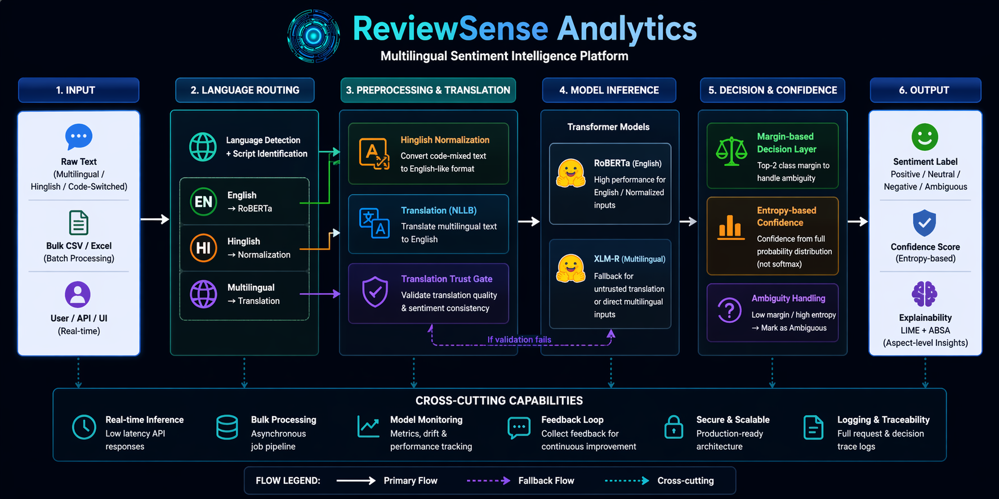
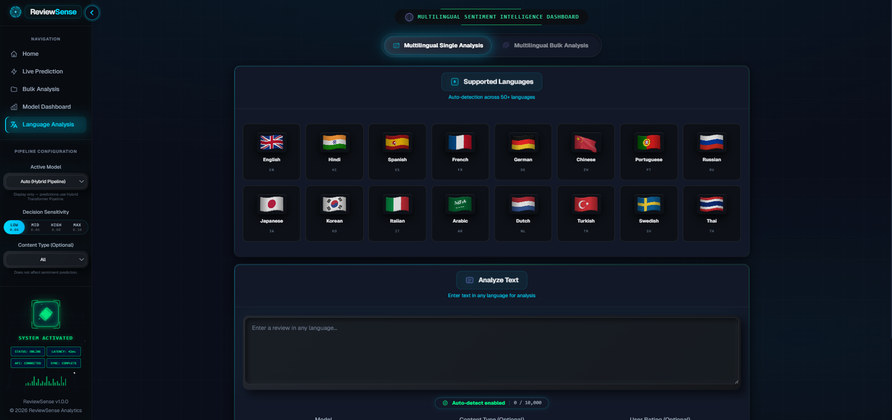

<div align="center">


# ReviewSense Analytics

### Production-ready multilingual sentiment intelligence platform

### **Hybrid Transformer Routing • Confidence-Aware Decisions • Explainable AI**

<br>

<p>
  
  
  
  
  
</p>

</div>

---

## 🎬 Live Demo

<div align="center">

<a href="https://github.com/amansethhh/ReviewSense-Analytics/releases/download/v1.0/demo.mp4">
  
</a>

</div>

---

## 🌍 Why This Matters

* Businesses receive **multilingual, mixed-language feedback daily**
* Traditional models fail on **code-switched (Hinglish) inputs**
* Translation errors silently degrade prediction quality
* Incorrect sentiment → **wrong business decisions**

**ReviewSense solves this with reliable, explainable, multilingual intelligence**

---

## ⚡ Key Highlights

* Hybrid transformer routing (RoBERTa + XLM-R + NLLB)
* Hinglish normalization for real-world inputs
* Translation trust validation (fail-safe fallback)
* Margin-based decision layer (ambiguity control)
* Entropy-based confidence calibration
* Explainability via LIME + ABSA
* Real-time + bulk processing pipeline

---

## 🧩 Use Cases

* E-commerce product review analysis
* Social media sentiment monitoring
* Multilingual customer feedback systems
* Market research & brand intelligence

---

## 🎯 Problem

* Multilingual input breaks traditional models
* Translation introduces hidden errors
* Confidence scores are misleading
* Ambiguous predictions are mishandled
* Lack of explainability

---

## 💡 Solution Overview

<div align="center">

| Layer                  | Purpose                                  |
| ---------------------- | ---------------------------------------- |
| Language Routing       | Detect English / Hinglish / Multilingual |
| Hinglish Normalization | Clean code-mixed input                   |
| Translation (NLLB)     | Convert multilingual → English           |
| Validation Layer       | Verify translation quality               |
| Model Layer            | RoBERTa / XLM-R inference                |
| Decision Layer         | Margin-based ambiguity handling          |
| Confidence Layer       | Entropy calibration                      |
| Explainability         | LIME + ABSA                              |

</div>

---

## 🧠 Core Innovations

* Model-first architecture (no heuristics)
* Margin-based ambiguity detection
* Entropy-based confidence (not softmax)
* Translation trust gating system

---

## 🧩 Architecture Diagram

<div align="center">



</div>

---

## 📊 Performance

<div align="center">

| Metric    | Value |
| --------- | ----- |
| Accuracy  | ~91%  |
| Precision | ~0.92 |
| Recall    | ~0.91 |
| F1 Score  | ~0.90 |

</div>

<sub>Evaluated on mixed multilingual dataset (real-world inputs)</sub>

---

## 🖼️ UI Preview

<div align="center">

<table>
<tr>
<td align="center"><br/>Home</td>
<td align="center"><br/>Live Prediction</td>
</tr>
<tr>
<td align="center"><br/>Model Dashboard</td>
<td align="center"><br/>Multilingual Analysis</td>
</tr>
</table>

</div>

---

## 🏗️ Tech Stack

<div align="center">

| Layer          | Technology            |
| -------------- | --------------------- |
| Backend        | FastAPI, Uvicorn      |
| Frontend       | React, TypeScript     |
| Models         | RoBERTa, XLM-R        |
| Translation    | Meta NLLB             |
| Explainability | LIME, ABSA            |
| ML Stack       | PyTorch, Transformers |
| Data           | Pandas, NumPy         |

</div>

---

## 📂 Project Structure (Engineering-Level)

```bash
ReviewSense-Analytics/
│
├── backend/
│   ├── app/
│   │   ├── main.py
│   │   ├── routes/
│   │   ├── services/
│   │   ├── schemas/
│   │   ├── core/
│   │   └── utils/
│   └── tests/
│
├── frontend/
│   ├── src/
│   │   ├── components/
│   │   ├── pages/
│   │   ├── hooks/
│   │   ├── services/
│   │   └── styles/
│
├── src/
│   ├── models/
│   ├── pipeline/
│   ├── preprocessing/
│   ├── translation/
│   ├── decision/
│   └── predict.py
│
├── docs/
│   └── images/
│
├── scripts/
├── reports/
├── data/
└── start.ps1
```

---

## 🔌 API Overview

<div align="center">

| Method | Endpoint  | Description         |
| ------ | --------- | ------------------- |
| GET    | /health   | Health check        |
| POST   | /predict  | Real-time sentiment |
| POST   | /bulk     | Bulk CSV processing |
| GET    | /metrics  | Model metrics       |
| POST   | /feedback | Feedback logging    |

</div>

---

## ⚠️ Design Principles

* No heuristics
* Model-first decisions
* Deterministic outputs
* Translation-aware routing
* Fully traceable pipeline

---

## 🔮 Future Work

* Domain-specific fine-tuning
* Advanced translation scoring
* Sarcasm detection upgrade
* CI/CD + deployment pipeline

---

## 📜 License

MIT License

---

<div align="center">

Built with ❤️ by <a href="https://github.com/amansethhh">amansethhh</a>

</div>
