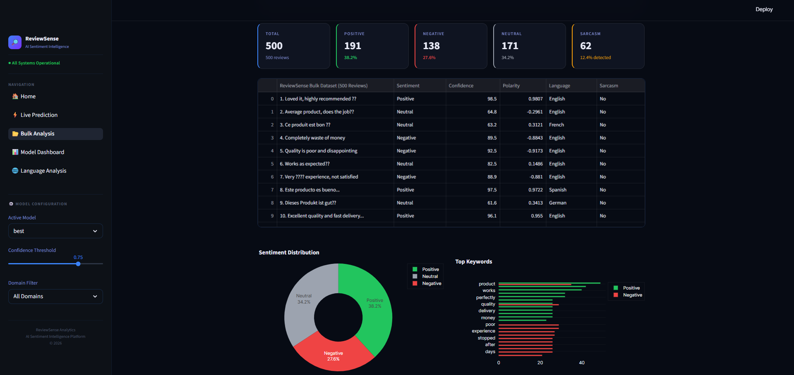
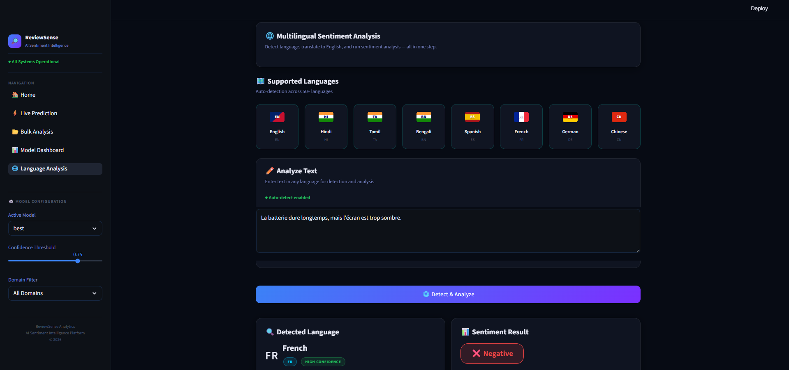

# 🔎 ReviewSense Analytics

> **AI-powered, multi-domain sentiment intelligence platform — transformer-based NLP, real-time explainability, and production-grade ML pipelines in a Streamlit web app.**

<p align="left">
  
  
  
  
  
  
</p>

---

## 📌 Overview

### The Problem

Businesses receive thousands of customer reviews daily across multiple languages and domains. Manually reading, categorizing, and extracting actionable insights from this volume of unstructured text is not scalable. Standard keyword-based approaches miss context, fail on sarcasm, and cannot explain *why* a prediction was made.

### The Solution

ReviewSense Analytics is a full-stack NLP platform that transforms raw customer reviews into structured, actionable intelligence. It classifies reviews as **Negative / Neutral / Positive** across five domains — food products, movies, airlines, Indian e-commerce, and social media — and goes further with sarcasm detection, aspect-level opinion mining, multilingual support, and LIME-based explainability.

### Real-World Relevance

| Use Case | How ReviewSense Helps |
|---|---|
| **E-commerce** | Identify product-specific complaints (battery, screen, delivery) at scale |
| **Hospitality & Airlines** | Track service quality trends across multilingual guest feedback |
| **Media & Entertainment** | Monitor audience sentiment on movie/show reviews in real time |
| **Data Science Teams** | Compare classical ML baselines against transformer models with a single dashboard |

---

## ✨ Key Features

### 🔹 Core Features

| Feature | Details |
|---|---|
| ⚡ **Live Sentiment Prediction** | Analyze any review instantly — returns Negative / Neutral / Positive / Uncertain with confidence score, polarity (−1 to +1), and subjectivity |
| 📂 **Bulk Review Analysis** | Upload CSV or Excel files (up to 200 MB), map text columns, enable analysis modules, and receive a fully enriched dataset with per-row results |
| 🌐 **Multilingual Analysis** | Auto-detects 50+ languages via `langdetect`, translates to English with Helsinki-NLP MarianMT (googletrans fallback), then runs the full pipeline |
| 📊 **Model Performance Dashboard** | Side-by-side evaluation of LinearSVC, Logistic Regression, Naive Bayes, and Random Forest — accuracy, Macro F1, confusion matrices, ROC-AUC curves, and training times |

### 🔹 Advanced Features

| Feature | Details |
|---|---|
| 🔬 **Aspect-Based Sentiment Analysis (ABSA)** | Extracts noun-phrase aspects using spaCy, then scores each with RoBERTa to surface granular product-level opinions |
| 😏 **Sarcasm Detection** | `cardiffnlp/twitter-roberta-base-irony` detects irony with confidence score and severity level to prevent sentiment mis-classification |
| 🔍 **LIME Explainability** | Token-level highlight map and importance bar chart showing which words drove each prediction; `num_samples=100` for ~10× speedup; results cached 1 hour |
| 🤖 **AI Summary** | LSA extractive summarizer (`sumy`) auto-generates key takeaways and narratives from review batches |
| 📄 **PDF Export** | One-click professional PDF report generation via `fpdf2` for single and bulk analyses |
| 🔄 **Real-Time Batch Pipeline** | Vectorized batch inference (batch_size=32 for sentiment, 16 for sarcasm) with live progress callbacks |

### 🔹 UX Features

- **Glassmorphism dark UI** — 537-line custom CSS, deep `#070b14` background, frosted-glass card components
- **Anti-flicker session state** — `st.session_state` ensures results survive Streamlit rerenders without redundant model calls
- **Animated progress tracking** — real-time pipeline status with percentage and descriptive stage messages
- **Polarity gauge** — interactive Plotly gauge chart visualizing sentiment on a −1 → +1 scale
- **Multi-format export** — download results as CSV, JSON, PDF, or Excel from every analysis page
- **Eager model preloading** — all transformer models initialized at startup to eliminate cold-start latency

---

## 🖼️ Demo Screenshots

### 🏠 Home Dashboard


### ⚡ Live Prediction


### 📂 Bulk Analysis



### 📊 Model Dashboard


### 🌐 Language Analysis



---

## 🛠️ Tech Stack

### Frontend

| Library | Version | Role |
|---|---|---|
| **Streamlit** | ≥ 1.36 | Multi-page web application framework |
| **Custom CSS** | — | Glassmorphism dark theme, metric cards, tag pills, loading animations |
| **Plotly** | ≥ 5.22 | Interactive charts, gauges, heatmaps, bar charts |
| **Matplotlib / Seaborn** | ≥ 3.9 / ≥ 0.13 | Static figures saved to `reports/figures/` |

### Backend / ML Pipeline

| Library | Version | Role |
|---|---|---|
| **Transformers (HuggingFace)** | ≥ 4.44 | RoBERTa sentiment + irony; MarianMT translation |
| **PyTorch** | ≥ 2.3 | Tensor inference backend |
| **scikit-learn** | ≥ 1.5 | TF-IDF vectorizer, LinearSVC, Logistic Regression, Naive Bayes, Random Forest |
| **spaCy** | ≥ 3.7 | Aspect noun-phrase extraction (`en_core_web_sm`) |
| **LIME** | ≥ 0.2 | Local Interpretable Model-Agnostic Explanations |
| **sumy** | ≥ 0.11 | Extractive LSA summarization |

### NLP Utilities

| Library | Version | Role |
|---|---|---|
| **NLTK** | ≥ 3.9 | Text preprocessing, tokenization |
| **TextBlob** | ≥ 0.19 | Subjectivity scoring |
| **langdetect** | ≥ 1.0.9 | Language identification (50+ languages) |
| **googletrans** | 4.0.0-rc1 | Translation fallback when MarianMT fails |
| **sentencepiece** | ≥ 0.2 | Subword tokenization for MarianMT |

### Utilities & Export

| Library | Version | Role |
|---|---|---|
| **pandas / NumPy** | ≥ 2.3 | Data wrangling and numerical operations |
| **joblib** | ≥ 1.4 | Model serialization / deserialization (`.pkl`) |
| **fpdf2** | ≥ 2.7 | PDF report generation |
| **openpyxl** | ≥ 3.1 | Excel export |
| **tqdm** | ≥ 4.67 | Progress bars during training scripts |

### HuggingFace Models

| Model ID | Purpose | Output |
|---|---|---|
| `cardiffnlp/twitter-roberta-base-sentiment-latest` | Core sentiment classifier | `Negative` / `Neutral` / `Positive` (softmax probabilities) |
| `cardiffnlp/twitter-roberta-base-irony` | Sarcasm / irony detection | `irony` probability; threshold > 0.80 → sarcasm |
| `Helsinki-NLP/opus-mt-mul-en` | Multilingual → English translation | English text via MarianMT (offline-capable) |

---

## 📁 Project Structure

```
ReviewSense-Analytics/
│
├── app/                                 # Streamlit multi-page web application
│   ├── app.py                           # Home page — hero card, KPI metrics, capability overview, quick-actions
│   ├── utils.py                         # Shared helpers: load_css(), load_model()
│   └── pages/
│       ├── 01_Live_Prediction.py        # Single review: sentiment + LIME + ABSA + sarcasm + export
│       ├── 02_Bulk_Analysis.py          # Batch pipeline: CSV/Excel upload, enriched output, charts, export
│       ├── 03_Model_Dashboard.py        # Classical ML comparison: accuracy, F1, confusion matrix, ROC
│       └── 04_Language_Analysis.py      # Multilingual: auto-detect, translate, full NLP pipeline
│
├── src/                                 # Core ML / NLP engine
│   ├── config.py                        # Project-wide constants (paths, model IDs, label maps, domains)
│   ├── preprocess.py                    # Data cleaning, stratified train/val/test splitting
│   ├── train_classical.py               # TF-IDF + 4 classical models; writes reports/model_results.json
│   ├── evaluate.py                      # Accuracy, F1, confusion matrix, ROC-AUC helpers
│   ├── predict.py                       # Classical model inference helpers
│   ├── absa.py                          # ABSA wrapper → delegates to src/models/aspect.py
│   ├── lime_explainer.py                # LIME wrapper with 1-hour caching and token highlighting
│   ├── summarizer.py                    # LSA extractive review summarization (sumy)
│   ├── analytics.py                     # Centralized metrics: sentiment distribution, keywords, charts
│   ├── exporter.py                      # 4-format export buttons (CSV / JSON / PDF / Excel)
│   ├── pdf_exporter.py                  # fpdf2 PDF report generation
│   ├── models/
│   │   ├── sentiment.py                 # RoBERTa: predict() / predict_batch() — cached via @st.cache_resource
│   │   ├── sarcasm_model.py             # RoBERTa irony: predict() / predict_batch()
│   │   ├── translation.py               # MarianMT translation with googletrans fallback
│   │   ├── language.py                  # langdetect wrapper with ISO code + flag emoji mapping
│   │   └── aspect.py                    # spaCy noun-phrase extraction + RoBERTa per-aspect scoring
│   └── pipeline/
│       └── inference.py                 # run_pipeline() / run_pipeline_batch() — unified NLP orchestrator
│
├── ui/                                  # Shared UI / theming layer
│   ├── sidebar.py                       # Navigation sidebar with CSS loader and config toggles
│   ├── theme.py                         # Plotly dark theme: apply_theme(), colour palette constants
│   └── styles.css                       # Glassmorphism CSS (537 lines) — cards, badges, animations
│
├── data/
│   ├── processed/                       # reviewsense_dataset.csv (gitignored — place manually)
│   └── exports/                         # Generated export files
│
├── models/
│   ├── classical/                       # Saved sklearn pipelines (.pkl) + TF-IDF vectorizer
│   └── roberta/                         # Fine-tuned RoBERTa checkpoints
│
├── reports/
│   ├── model_results.json               # Training metrics: accuracy, F1, confusion_matrix, ROC, training_time_sec
│   └── figures/                         # Saved Matplotlib / Seaborn plot images
│
├── scripts/
│   ├── generate_demo_artifacts.py       # Creates placeholder model files — run app without training
│   ├── optimize_and_train.py            # Hyperparameter optimization script
│   ├── train_final.py                   # Final production model training
│   └── verify_model.py                  # Post-training model verification
│
├── notebooks/                           # Exploratory Jupyter notebooks
├── colab/                               # Google Colab training notebooks
├── requirements.txt
└── README.md
```

---

## ⚙️ How It Works — NLP Pipeline

### Single Review Pipeline (`run_pipeline`)

```
User Input  (any language, any domain)
        │
        ▼
  1. Language Detection ──── langdetect → ISO 639-1 code + flag emoji
        │
        ▼
  2. Translation (if needed) ─── Helsinki-NLP/opus-mt-mul-en (MarianMT)
        │                         └── fallback: googletrans
        ▼
  3. Sentiment Prediction ─── cardiffnlp/twitter-roberta-base-sentiment-latest
        │   → label:        Negative / Neutral / Positive
        │   → confidence:   softmax probability of top class
        │   → polarity:     scores[Pos] − scores[Neg]   ∈ [−1, +1]
        │   → subjectivity: 1.0 − scores[Neu]           ∈ [ 0,  1]
        │   → if confidence < 0.60 → label = "Uncertain"
        ▼
  4. Sarcasm Detection (optional) ─── cardiffnlp/twitter-roberta-base-irony
        │   → is_sarcastic (bool), irony_probability, severity level
        ▼
  5. Aspect Analysis (optional) ─── spaCy (noun-phrase extraction)
        │   → per-aspect RoBERTa polarity scoring
        ▼
  6. LIME Explainability (optional) ─── LimeTextExplainer (num_samples=100)
        │   → top-6 token weights + HTML highlight map
        ▼
  Output: { sentiment, confidence, polarity, subjectivity,
            language, translated_text, sarcasm, aspects, lime }
```

### Batch Pipeline (`run_pipeline_batch`)

```
CSV / Excel upload  (up to 200 MB)
        │
        ▼
  Stage 1 — Language Detection + Translation  (per-row, unavoidable)
        ▼
  Stage 2 — Vectorized Sentiment Inference   (batch_size=32) ── ~10× faster
        ▼
  Stage 3 — Vectorized Sarcasm Inference     (batch_size=16, optional)
        ▼
  Stage 4 — Per-Row Aspect Analysis          (optional)
        ▼
  Enriched DataFrame:
    + Sentiment  + Confidence  + Polarity  + Subjectivity
    + Language   + Sarcasm%    + Aspects
        ▼
  Visualizations:
    · Pie chart (sentiment distribution)
    · Keyword comparison (positive vs. negative)
    · Sentiment trend line (6-month simulation)
    · AI summary narrative
        ▼
  Export: CSV / JSON / PDF / Excel
```

### Multilingual Pipeline

```
Non-English Text
        │
        ▼  langdetect → ISO 639-1 code
        ▼  Helsinki-NLP/opus-mt-mul-en  ──[fail]──▶  googletrans
        ▼  English translation
        ▼  Full sentiment + sarcasm + ABSA + LIME pipeline
        ▼  Results tagged with detected language + flag emoji
```

---

## 🚀 Installation — Local Setup

### Prerequisites

- Python 3.10 or higher
- `pip` package manager
- *(Optional)* CUDA-capable GPU for faster transformer inference

### Steps

```bash
# 1. Clone the repository
git clone https://github.com/amansethhh/ReviewSense-Analytics.git
cd ReviewSense-Analytics

# 2. Install Python dependencies
pip install -r requirements.txt

# 3. Download the spaCy English model (required for Aspect-Based Sentiment Analysis)
python -m spacy download en_core_web_sm

# 4a. Quick demo — no dataset or training required
#     Generates placeholder model artifacts so the full dashboard runs immediately
python scripts/generate_demo_artifacts.py

# 4b. OR: Train on the full dataset
#     Place reviewsense_dataset.csv in data/processed/ first
python src/preprocess.py
python src/train_classical.py

# 5. Launch the Streamlit application
streamlit run app/app.py
```

Open `http://localhost:8501` in your browser.

> **First-run note:** The transformer models (`cardiffnlp/twitter-roberta-base-sentiment-latest`, `cardiffnlp/twitter-roberta-base-irony`, `Helsinki-NLP/opus-mt-mul-en`) will be downloaded from HuggingFace Hub on first run (~1–2 GB total). They are cached locally and load in seconds on subsequent runs.

---

## ☁️ Deployment — Streamlit Cloud

1. Push your repository to GitHub. Ensure large files (models, datasets) are listed in `.gitignore` or managed via Git LFS.
2. Go to [share.streamlit.io](https://share.streamlit.io) and sign in with your GitHub account.
3. Click **New app**, select your repository, branch, and set the main file path to `app/app.py`.
4. Add any required secrets (e.g., API keys) in the **Secrets** panel.
5. Click **Deploy**. Streamlit Cloud installs `requirements.txt` automatically and starts the server.

> **Performance tip:** Transformer models are re-downloaded on each cold start in Streamlit Cloud. For production deployments, consider using `@st.cache_resource` with a persistent cache directory or pre-baking model weights into a Docker image.

---

## ⚡ Performance Optimizations

| Technique | Location | Effect |
|---|---|---|
| `@st.cache_resource` | `sentiment.py`, `sarcasm_model.py`, `translation.py` | Transformer models loaded **once** per session — instant on all subsequent calls |
| `@st.cache_data(ttl=3600)` | `lime_explainer.py → explain_prediction()` | LIME results cached for 1 hour — repeat analyses return instantly |
| `LIME_NUM_SAMPLES = 100` | `lime_explainer.py` | ~10× speedup vs. the default 5,000 perturbation samples |
| Chunked batch inference (`batch_size=32`) | `sentiment.py → predict_batch()` | Vectorized inference prevents OOM errors on large CSV uploads |
| Chunked batch sarcasm (`batch_size=16`) | `sarcasm_model.py → predict_batch()` | Sarcasm scoring across thousands of rows without memory spikes |
| `st.session_state` for all results | All page files | Predictions survive Streamlit rerenders — zero redundant model calls |
| Real-time progress callback | `inference.py → run_pipeline_batch()` | UI stays fully responsive via `progress_callback(pct, message)` during long batches |
| `preload_models()` at startup | `inference.py` | All transformer models initialized at page load — eliminates cold-start latency |

---

## 📝 Sample Inputs & Outputs

### Input Examples

| Review Text | Language | Expected Sentiment |
|---|---|---|
| `"The battery lasts all day and the camera quality is exceptional."` | English | ✅ Positive |
| `"Delivery took 3 weeks, product was damaged, never buying again."` | English | ❌ Negative |
| `"It works as described. Nothing special, nothing bad."` | English | ◼ Neutral |
| `"Oh great, another product that breaks after two uses. Fantastic."` | English | 😏 Sarcasm → Negative |
| `"La batterie dure longtemps, mais l'écran est trop sombre."` | French 🇫🇷 | ❌ Negative |
| `"बहुत अच्छा उत्पाद है, मुझे बहुत पसंद आया।"` | Hindi 🇮🇳 | ✅ Positive |

### Output Structure

For the input `"The battery lasts all day and the camera quality is exceptional."`:

```json
{
  "sentiment":    "Positive",
  "confidence":   0.96,
  "polarity":     0.91,
  "subjectivity": 0.74,
  "language":     "en",
  "translated":   "The battery lasts all day and the camera quality is exceptional.",
  "sarcasm": {
    "is_sarcastic":   false,
    "confidence":     0.04,
    "severity":       "none"
  },
  "aspects": [
    { "aspect": "battery",        "polarity":  0.88 },
    { "aspect": "camera quality", "polarity":  0.93 }
  ]
}
```

### Output Fields Reference

| Field | Type | Description |
|---|---|---|
| `sentiment` | `str` | `Positive` / `Negative` / `Neutral` / `Uncertain` (confidence < 60%) |
| `confidence` | `float` | Softmax probability of the predicted class (0–1) |
| `polarity` | `float` | `scores[Pos] − scores[Neg]` — range −1 (very negative) to +1 (very positive) |
| `subjectivity` | `float` | `1.0 − scores[Neu]` — higher = more opinionated text |
| `language` | `str` | Detected ISO 639-1 language code |
| `translated` | `str` | English translation used for inference |
| `sarcasm.is_sarcastic` | `bool` | `true` if irony probability > 0.80 |
| `sarcasm.severity` | `str` | `none` / `mild` / `moderate` / `severe` |
| `aspects` | `list` | Noun-phrase aspects with individual RoBERTa polarity scores |

---

## ⚠️ Limitations

- **Sarcasm accuracy** — The Cardiff RoBERTa irony model is trained on Twitter data; performance may degrade on formal, long-form, or domain-specific text.
- **Neutral class recall** — Classical ML models exhibit low recall for the Neutral class (Macro F1: 0.01–0.13) due to class imbalance in training data. SMOTE or class-weighted training is recommended.
- **LIME latency** — First-run LIME generation takes a few seconds (100 perturbation samples × RoBERTa inference per token). Results are cached for 1 hour after the initial call.
- **Translation edge cases** — `Helsinki-NLP/opus-mt-mul-en` is a general multi-to-English model; domain-specific terminology (technical jargon, brand names, idioms) may not translate accurately.
- **Dataset not included** — The full `reviewsense_dataset.csv` (~1.3 M rows) is excluded due to file-size constraints. Classical models must be retrained locally after placing the dataset in `data/processed/`.
- **Uncertainty threshold fixed** — Reviews with confidence < 60% are labelled `Uncertain`. This cutoff is not currently configurable from the UI.
- **ABSA granularity** — Aspect extraction relies on spaCy noun-chunk detection; short or grammatically informal reviews may yield fewer or less precise aspect terms.

---

## 🔭 Future Improvements

- [ ] **REST API** — Expose `run_pipeline()` via a FastAPI endpoint for programmatic integrations
- [ ] **Fine-tune RoBERTa on domain data** — Custom training on `reviewsense_dataset` for higher domain-specific accuracy
- [ ] **SMOTE / class-weighted training** — Address Neutral-class imbalance in classical model training
- [ ] **Async LIME** — Run LIME in a background thread so sentiment results are returned immediately while explanations generate asynchronously
- [ ] **Configurable confidence threshold** — UI slider to adjust the `Uncertain` label cutoff from the dashboard
- [ ] **Docker deployment** — Containerize the full app for reproducible cloud deployments (GCP, AWS, Azure)
- [ ] **Additional export formats** — PowerPoint slides, standalone HTML reports
- [ ] **Dashboard authentication** — Add an authentication layer for enterprise / multi-user deployments

---

## 👤 Author

**Aman Seth**  
Full-Stack Python Developer

---

## 📄 License

This project is licensed under the **MIT License** — see the [LICENSE](LICENSE) file for details.

