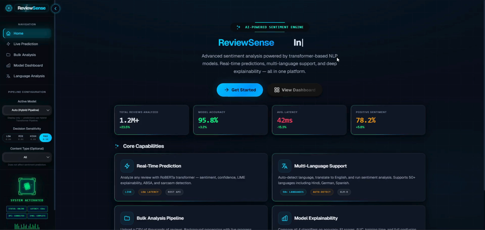
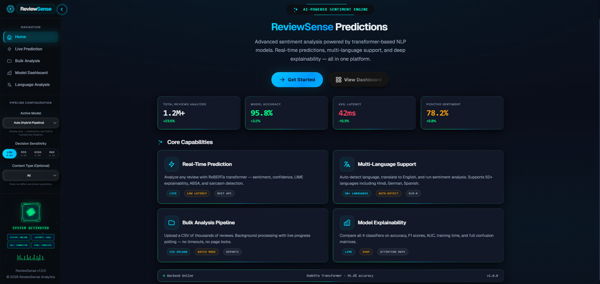
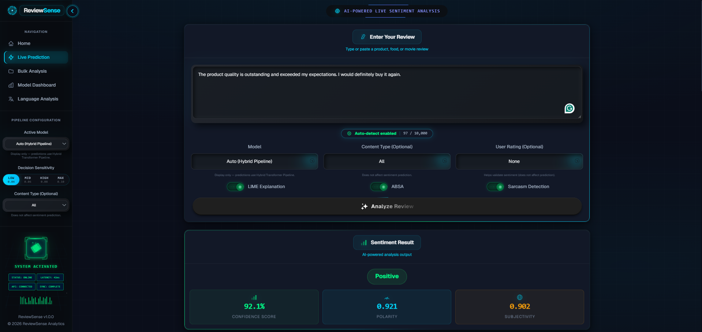
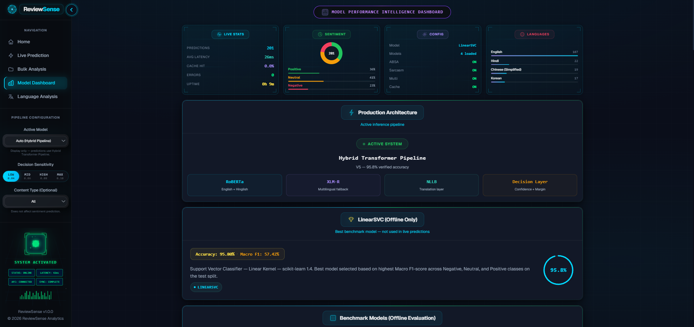

<div align="center">

<h1><b>ReviewSense Analytics</b></h1>

**Production-ready multilingual sentiment intelligence platform with hybrid transformer routing and confidence-aware decisions.**

[](https://python.org)
[](https://fastapi.tiangolo.com)
[](https://react.dev)
[](https://huggingface.co/docs/transformers)
[](LICENSE)

</div>

---

## 🎬 Live Demo

<a href="https://github.com/amansethhh/ReviewSense-Analytics/releases/download/v1.0/demo.mp4"></a>

*Click to watch full system demo — real-time multilingual prediction, bulk analysis, explainability, and dashboard.*

---

## ⚡ Key Highlights

- **Hybrid transformer routing:** RoBERTa (English) + XLM-R (multilingual fallback) + NLLB translation layer  
- **Hinglish normalization pipeline** before English-model inference  
- **Translation trust validation** with fail-safe fallback to XLM-R  
- **Margin-based decision layer** to handle ambiguous predictions  
- **Entropy-based confidence calibration** instead of raw softmax confidence  
- **Explainability stack:** LIME + ABSA for interpretable outputs  
- **Dual runtime modes:** real-time single prediction + asynchronous bulk pipeline  

---

## 🎯 Problem

Modern sentiment systems often fail in production because they:

- Break on multilingual and code-switched input
- Assume translations are always correct
- Mis-handle ambiguous model outputs
- Report overconfident scores on uncertain predictions
- Hide decision logic from users and reviewers

---

## 💡 Solution Overview

| Layer | Purpose |
|---|---|
| Language Routing | Detects English, Hinglish, and multilingual flows for correct model path |
| Hinglish Normalization | Converts code-switched text into model-ready English-like input |
| Translation Layer (NLLB) | Translates multilingual text when needed for higher-quality routing |
| Translation Trust Gate | Validates translation quality and sentiment consistency |
| Sentiment Inference | Uses RoBERTa for English routes and XLM-R for multilingual fallback |
| Decision Layer | Applies margin checks and ambiguity handling |
| Confidence Calibration | Uses entropy-based confidence scoring |
| Explainability Layer | Exposes LIME and ABSA signals for traceable predictions |

---

## 🧠 Core Innovations

- **Heuristic Removal**  
  Legacy heuristic label overrides were removed; prediction flow is model-first and deterministic.

- **Margin-Based Decision Layer**  
  Uses top-2 class margin to detect ambiguity and reduce brittle edge-case decisions.

- **Entropy Confidence**  
  Confidence is calibrated from full probability distribution entropy, not a single max score.

- **Translation Trust Gate**  
  Translation output is validated before use; failed validation routes directly to multilingual fallback.

---

## ⚙️ System Architecture

```text
Input Text
   |
   v
Language Detection
(Hinglish check -> script/lang detect)
   |
   v
Route Selector
  |---------------------------|------------------------------|
  v                           v                              v
English                   Hinglish                     Multilingual
  |                           |                              |
RoBERTa                 Normalize Text                      NLLB
  |                           |                              |
  |                      RoBERTa on normalized text     Trust Validation
  |                                                         |        |
  |                                                         |pass    |fail
  |                                                         v        v
  |                                                      RoBERTa    XLM-R
  |                                                         |
  ---------------------------v-------------------------------
                      Margin Decision Layer
                              |
                      Entropy Confidence
                              |
                   Explainability (LIME + ABSA)
                              |
                           Output API
```

---

## 📊 Performance

| Metric | Value |
|---|---|
| Reported best system accuracy | **95.8%** |
| Classical benchmark (Naive Bayes) | 88.6% accuracy |
| Classical benchmark (LinearSVC) | 85.7% accuracy |
| Classical benchmark (Logistic Regression) | 85.7% accuracy |
| Classical benchmark (Random Forest) | 74.3% accuracy |

- Includes multilingual routing with transformer-first inference paths  
- **Evaluated on mixed multilingual dataset**

---

## 🖼️ UI Preview

<table>
<tr>
<td align="center"><br/><b>Home</b></td>
<td align="center"><br/><b>Live Prediction</b></td>
</tr>
<tr>
<td align="center"><br/><b>Bulk Analysis</b></td>
<td align="center"><br/><b>Model Dashboard</b></td>
</tr>
</table>

---

## 🏗️ Tech Stack

| Layer | Tech |
|---|---|
| API | FastAPI, Uvicorn, Pydantic |
| Frontend | React 18, TypeScript, Vite |
| Sentiment Models | RoBERTa, XLM-R |
| Translation | Meta NLLB (`facebook/nllb-200-distilled-600M`) |
| Explainability | LIME, ABSA |
| ML Runtime | PyTorch, Transformers |
| Data/Training Utilities | scikit-learn, pandas, NumPy |
| Packaging/Dev | npm, Python virtual environment |

---

## 📂 Project Structure

```text
ReviewSense-Analytics/
├── backend/                  # FastAPI service and API routes
│   ├── app/
│   │   ├── main.py
│   │   ├── routes/
│   │   └── utils/
│   └── tests/
├── frontend/                 # React + TypeScript client
│   └── src/
├── src/                      # Core ML pipeline modules
│   ├── models/
│   ├── pipeline/
│   └── predict.py
├── reports/                  # Model metrics and evaluation outputs
├── scripts/                  # Training/evaluation utilities
└── data/                     # Feedback and translation stats
```

---

## 🚀 Getting Started

### Backend

```bash
pip install -r backend/requirements.txt
uvicorn backend.app.main:app --reload --port 8000
```

### Frontend

```bash
cd frontend
npm install
npm run dev
```

### One-command start

```powershell
.\start.ps1
```

---

## 🔌 API Overview

| Method | Endpoint | Description |
|---|---|---|
| GET | `/health` | Service health status |
| POST | `/predict` | Real-time sentiment prediction |
| POST | `/bulk` | Submit bulk CSV analysis job |
| GET | `/bulk/status/{job_id}` | Poll bulk processing status/results |
| GET | `/bulk/columns` | Inspect upload column schema |
| POST | `/language` | Multilingual analysis pipeline |
| GET | `/metrics` | Model and evaluation metrics |
| POST | `/feedback` | Store user feedback |

---

## ⚠️ Design Principles

- **No heuristics:** no heuristic label flipping in active inference path  
- **Model-first:** transformer outputs drive final decisions  
- **Deterministic:** stable routing and decision behavior for repeated inputs  
- **Translation-aware:** translation is validated before trust  
- **Traceable:** pipeline route and decision context are exposed in outputs  

---

## 🔮 Future Work

- Domain-specific fine-tuning for vertical datasets  
- Better translation quality scoring beyond pass/fail checks  
- Broader multilingual robustness testing at scale  
- Expanded production observability and drift monitoring  
- CI/CD hardening for model/version rollout workflows  

---

## 📜 License

This project is licensed under the [MIT License](LICENSE).

---

<div align="center">

**ReviewSense Analytics — engineered for trustworthy multilingual sentiment intelligence.**

</div>
